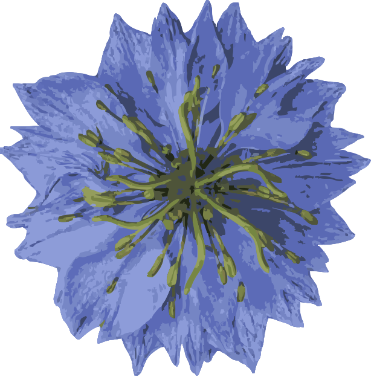

<p align="center">
  <a>
    
  </a>
</p>

<h1 align="center">LIbAM</h1>

<p align="center">
  <em>A Standardized Graph Alignment Library</em>
</p>

<p align="center">
  <a href="https://LIbAM.selfhost.dk">Documentation</a>
  ·
  <a href="./LICENSE.txt">MIT License</a>
</p>

---

## Install

```bash
uv add libam        # or: pip install libam
```

> Requires Python >= 3.12. Wheels target Linux x86-64.

## Access datasets simply with zero setup

Bundled datasets fetch themselves the first time you touch them.

## Algorithms

Every algorithm below can be constructed from `libam.algorithms` and run with the same
`.align()` call. Names link to the source research.

| Algorithm                                                                            | Source                                                                  |
|--------------------------------------------------------------------------------------|-------------------------------------------------------------------------|
| FUGAL - Feature-fortified Unrestricted Graph Alignment                               | [link](https://api.semanticscholar.org/CorpusID:276185086)              |
| GRAMPA - Spectral graph matching by pairwise eigen-alignments                        | [link](https://arxiv.org/abs/1907.08880)                                |
| GRAMPA-S - spectral variant of GRAMPA                                                | [link](https://github.com/constantinosskitsas/Framework_GraphAlignment) |
| CONE-Align - Consistent Network Alignment with proximity-preserving embeddings       | [link](https://doi.org/10.1145/3340531.3412136)                         |
| GWL - Gromov-Wasserstein Learning                                                    | [link](https://arxiv.org/abs/1901.06003)                                |
| S-GWL - Scalable Gromov-Wasserstein Learning                                         | [link](https://arxiv.org/abs/1905.07645)                                |
| Path - A Path Following Algorithm for graph matching                                 | [link](https://doi.org/10.1109/TPAMI.2008.245)                          |
| IsoRank - Global alignment of protein interaction networks                           | [link](https://doi.org/10.1073/pnas.0806627105)                         |
| NSD - Network Similarity Decomposition                                               | [link](https://doi.org/10.1109/TKDE.2011.174)                           |
| MMNC - Multi-order Matched Neighborhood Consistent alignment                         | [link](https://doi.org/10.1145/3539618.3591735)                         |
| DS++ - A tight relaxation for matching problems                                      | [link](https://doi.org/10.1145/3130800.3130826)                         |
| FGOT - Graph distances based on filters and optimal transport                        | [link](https://arxiv.org/abs/2109.04442)                                |
| GOT - An Optimal Transport framework for graph comparison                            | [link](https://arxiv.org/abs/1906.02085)                                |
| GRASP - Scalable Graph Alignment by spectral corresponding functions                 | [link](https://doi.org/10.1145/3561058)                                 |
| KLAUS - A graph-based method for pairwise global network alignment                   | [link](https://doi.org/10.1186/1471-2105-10-S1-S59)                     |
| LREA - Low Rank Spectral Network Alignment                                           | [link](https://doi.org/10.1145/3178876.3186128)                         |
| MDS - Unsupervised Manifold Alignment with joint multidimensional scaling            | [link](https://arxiv.org/abs/2207.02968)                                |
| Net-Align - Message-passing algorithms for sparse network alignment                  | [link](https://doi.org/10.1145/2435209.2435212)                         |
| PARROT - Position-Aware Regularized Optimal Transport                                | [link](https://doi.org/10.1145/3543507.3583357)                         |
| REGAL - Representation Learning-based Graph Alignment                                | [link](https://doi.org/10.1145/3269206.3271788)                         |
| Grad-Align+ - Gradual network alignment with attribute augmentation *(restricted)*   | [link](https://arxiv.org/abs/2208.11025)                                |
| JOENA - Joint Optimal Transport and Embedding for Network Alignment *(restricted)*   | [link](https://arxiv.org/abs/2502.19334)                                |
| HTC - Higher-order Topological Consistency for unsupervised alignment *(restricted)* | [link](https://arxiv.org/abs/2208.12463)                                |
| SlotA *(restricted)*                                                                 | [link](https://arxiv.org/abs/2301.12721)                                |
| Alpine - Partial Unlabeled Graph Alignment *(restricted)*                            | [link](https://doi.org/10.1145/3711896.3736839)                         |

> `next_align` is present but raises `NotImplementedError` (DGL compatibility), so it is
> not currently constructible.

## Development

```bash
uv run example/quickstart.py            # run the quickstart end-to-end
uv run pytest -n auto                   # test suite (parallel)
uv run ruff check --output-format=concise   # lint
uv run ty check --output-format=concise     # type-check
uv build                                # build wheels into dist/
uv run --group docs make -C docs html   # build the docs
```

## License

[MIT](./LICENSE.txt)